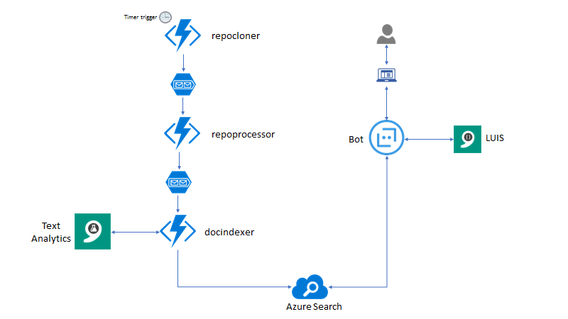

# Azure Helper Bot

This is a simple, proof of concept bot that leverages the following Azure services:
*   Azure Bot Service
*   Microsoft Cognitive Service – Text Analytics
*   Microsoft Cognitive Services – LUIS
*   Azure Search
*   Azure Functions

This bot allows a user to ask questions about Azure and responds with targeted documents that should help the user get the answers they need. 

Every month, a set of Azure functions pulls the latest set of Azure documentation down from the [Azure Docs](https://github.com/Microsoft/azure-docs) public github repo. It extracts out all the documents and processes through those, landing them in an Azure Search index.

The bot is built using the [bot framework](https://dev.botframework.com/) and Microsoft Cognitive Service [LUIS](https://www.luis.ai/) (Language Understanding Intelligent Service). LUIS has been trained to recognize certain phrases to determine the intent. If the intent is detected as a *search* intent then, with the training, it tries to extract out the search entity from the message. The bot framework sends the user’s message to LUIS and LUIS extracts the detected entity. The bot service then calls Azure Search with that extracted entity and constructs a message back to the user in the chat window.

# What it looks like



# How to use

Try the following types of phrases:

*   Tell me about x
*   What is x
*   How do I do x
*   What are my x limits

# How to set it up

1. Clone this repo.
2. cd into deploy folder.
3. Run deploy.ps1
4. When this is complete, navigate to the resource group and choose the bot service.
5. On the bot screen create a new application.
6. Choose NodeJS and choose LUIS.
7. Follow the steps in the portal to set up a LUIS app. This will create a blank luis app for you and connect it to the bot.
8. Switch to app settings (via settings->App Settings) and add the following two app settings:
    AzureSearchKey - this can be found from access keys in your Azure Search Service
    AzureSearchEndpoint - this will be the full url of your azure search service (e.g. https://mysearch.windows.net)
9. Navigate to chatbot folder in this repo.
10. Push the code from here into your bot app using the following:
```
git init
git add .
git commit -m "init"
git remote add azure "https://<name_of_your_bot>.scm.azurewebsites.net"
git push azure master
```
11. Navigate to your Azure Function service
12. Find the repocloner function and press Run. This will kick off the first run of the process to populate Azure Search. This process should take around 10 mins. You can verify it is complete when you see the index in Azure Search populated with several thousand documents.

Once this has complete you can begin to try out your chat bot. You will need to go to [https://luis.ai](https://luis.ai) and train LUIS with some utterances. Included in this repo is a set of precanned utterances that you can import directly into LUIS called LUISApp.json.

